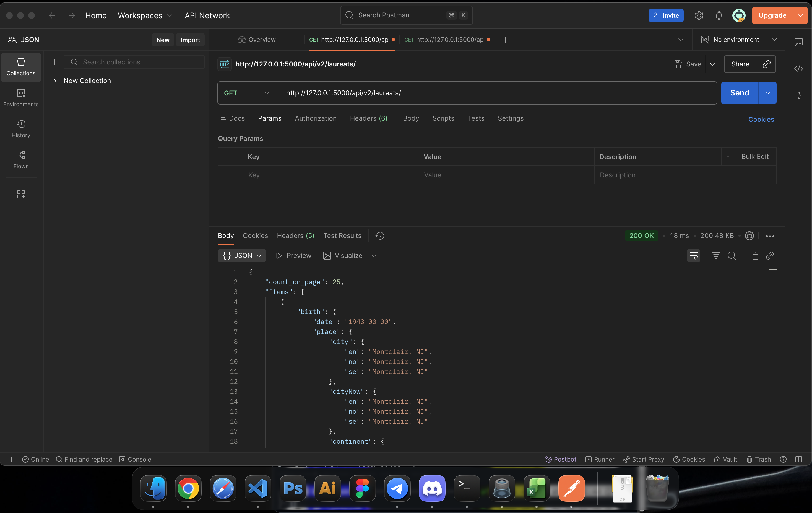
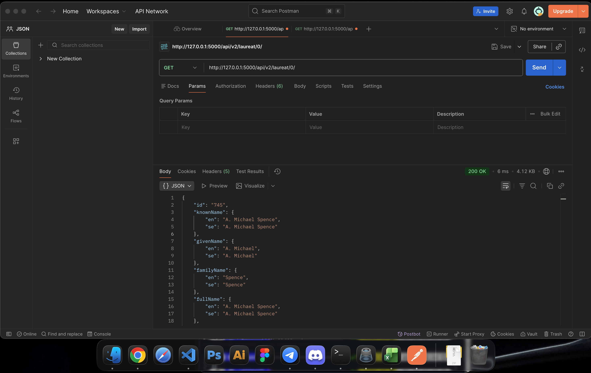
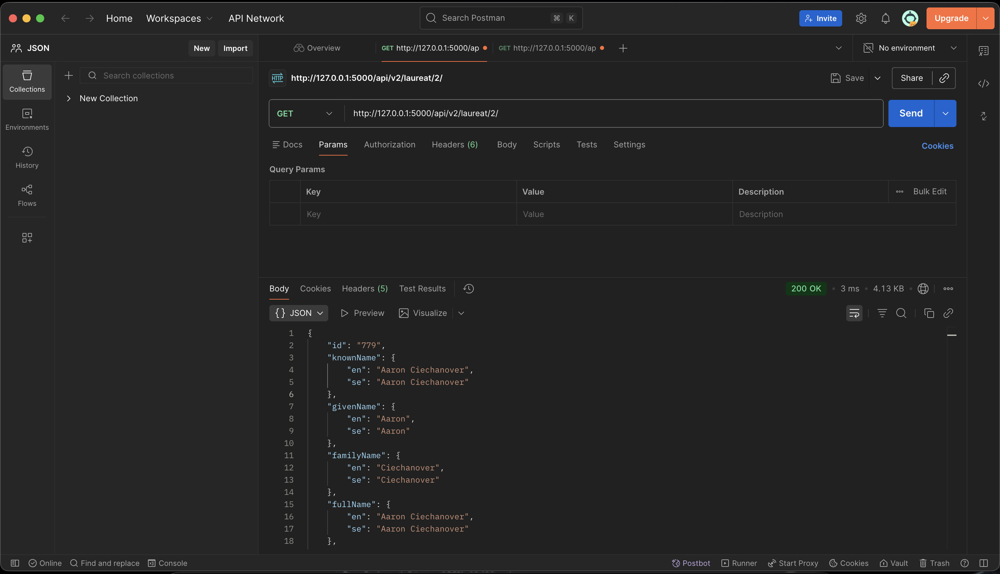
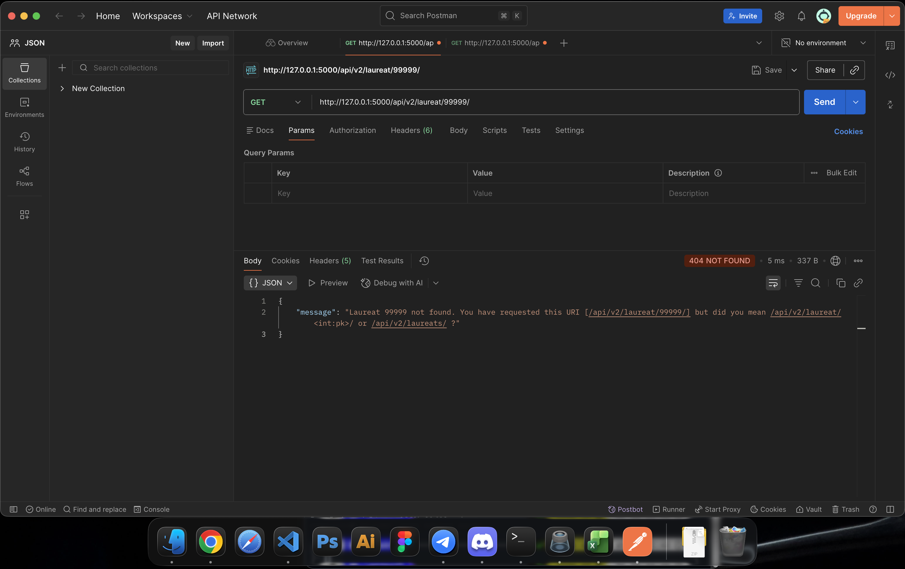
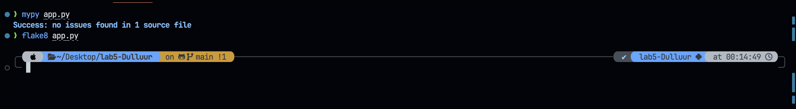

# Лабораторная работа 5. Создание API с помощью Flask-RESTX

## Скриншоты

### Список всех лауреатов

### Первый лауреат

### третий лауреат

### Не существующий лауреат

### Проходит проверку на flake и mypy

